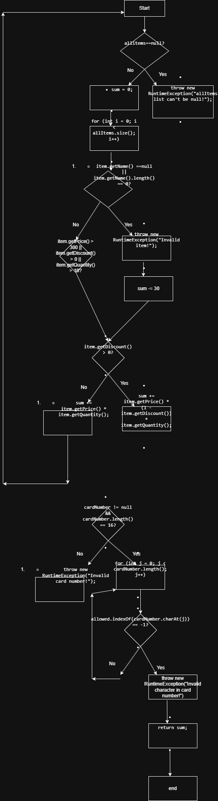

# SI_2025_lab2_211074
Име: Marija Stojoska  
Број на индекс: 211074
### Control Flow Graph (CFG)

### Statement Coverage

Потребни се минимум **3 тест случаи** за да се покријат сите statements во функцијата.

#### Тест случај 1
Влез: `null, "1234567812345678"`  
Излез: Исклучок – "allItems list can't be null!"

#### Тест случај 2
Влез: `[Item(null, 1, 100, 0)], "1234567812345678"`  
Излез: Исклучок – "Invalid item!"

#### Тест случај 3
Влез: `[Item("Телевизор", 1, 400, 0.1)], "1234567812345678"`  
Излез: 330.0
### Multiple Condition Coverage

Потребни се минимум **4 тест случаи** за да се покријат сите можни комбинации на условот:

```java
if (item.getPrice() > 300 || item.getDiscount() > 0 || item.getQuantity() > 10)

Цикломатска комплексност = 9  
Формула: M = E - N + 2P  
E = 19 (врски), N = 12 (јазли), P = 1 (компонента)  
M = 19 - 12 + 2*1 = 9
Комбинации:
1. T || - || - → Вистина (цената е над 300)
2. F || T || - → Вистина (има попуст)
3. F || F || T → Вистина (количина над 10)
4. T || T || T → Вистина
5. F || F || F → Лажно
